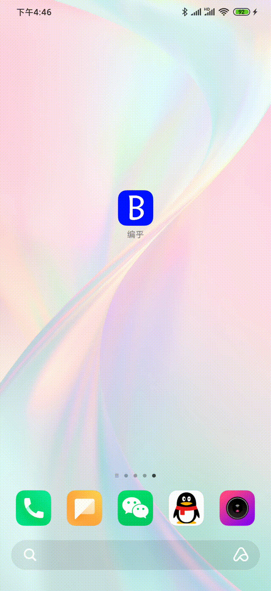

# APK安装版与测试中的版本存在不同，不同原因未知，该readme图片来自测试版本中，测试版本可直接下载文件打开即可，若图片无法查看，在 附属的文件内存储了对应的图片原版以供查看

### 一：核心功能

1.提问/回答/评论

2.登录/注册

### 二：主要界面

1.首界面

2.主页

3.登录

4.注册

5.问题表

6.提问

7.回答表

8.回答

9.评论表

10.评论

#### 以上为测试中图片，因未知原因安装apk后与测试中数据不符导致存在问题

### 三：使用步骤

​		打开软件首先看到主界面，1s后转入主页，点击上方的推荐进入问题表，右下角的悬浮按钮点击后，若尚未登录则进入登录界面，若以登录则进入提问界面，点击问题表中不同问题则可进入对应的回答表，右下角按钮同理，点击回答表中不同回答则可进入评论表中，点击其中评论则可对当前问题进行评论（因时间关系，暂时未在其中设定评论嵌套式评论，但后端中以完成对应设计）

​	

### 四：较重要的知识

1.活动的启动方式和在不同周期所进行的操作

2.百分比布局

3.碎片

4.数据跨活动传输

5.使用HTTP协议访问网络

6.JSON解析

7.悬浮按钮

### 五：仍然存在的一些问题

1.从主页碎片中切换至另一活动不流畅，且切换后无法返回上一活动

2.主页内各碎片切换无法返回（将其加入栈内会导致一个碎片的多次出现）

3.主页内碎片中获取数据存在延时，故提前创建了部分内容（解决方法可以参照issue活动，但因为不美观所以并未修改，原计划是在交作业前解决这一问题，不过现在看样子好像来不及，同时导致在碎片recomment中使用的预先写好的数据以暂时使用）

4.全局变量在切换活动后恢复成初始状态（导致在add_solution和add_comment活动中每次提交都需要再次登录并且进入后页存在account_name为空导致无法提交成功（暂时用数据传递解决））

5.UI设计不美观（主要集中在提问/回答/评论功能中，其他的相对还凑活能看）

6.初期对整体的构思有较大误差（导致自己写的后端上的数据库设计不合理进而影响了客户端获取内容并展示）

7.未使用本地数据库（导致账号登录每次都需要自行输入且暂时无法实现保存原有账号，以及每一次都需要去获取数据，造成了一定的时延，使用感受较差，主要原因在于开始设计时计划是将所有数据存储在后端中，但实际完成作业过程的测试中发现体验较差，但由于时间原因所以暂未修改）

8.未对从后端获取到的数据进行暂存（原因如上）且由于数据量较少，暂未设计分页或者类似操作，比如分段之类的（导致当数据量过大之后会使得展示出来需要大量时间，降低体验效果）

9.未防SQL注入。

10.命名过程中，存在部分活动和布局命名不够直观，导致在完成过程中出现过在错误的活动中进行操作的问题。

##### 11.存在未知原因导致apk安装出来的和测试中的版本存在不同？

### 六：心得体会

​		开始时对整体流程不了解，导致在初始的设计计划中存在较大的问题，比如后端数据提供与客户端的展示存在一定冲突，与此同时，由于熟练度不够，导致一些较为简单的操作却浪费了比较多的时间，再加上个人的UI设计能力较差，从而导致整个界面看起来相对有一些凌乱，最核心的地方在于，由于对它还不够了解，所以导致出现了较多的bug（如上一段）。

​		但整体来看，我个人认为，这一次的作业完成的质量是比较差的，虽然说理论上完成了主要功能（不过有几个地方因为不美观（但可以用app中展示的其他活动做法代替，不过不够美观）和全局变量自动恢复的问题导致仍然未能实现（但可以通过数据传输实现，不过因为这样设计不是很合理，所以主要还是想先修复这一问题）），也就相当于是为以后积累了一些经验吧。

​		最开始是计划在这次作业完成之后在app暂时余下的地方进行其他的功能设计，不过现阶段来看，由于我个人在后端上设计有一些问题以及在客户端上命名以及一些其他的问题，所以现在是准备重新在开一个项目完成，已经构思好了它的主体功能。由于这次作业中暴露出来的一些问题，比如前期设计过程中思考不够完善，导致后续的完成中后端和客户端配合时出现了一些问题，再加上命名格式不统一导致完成中出现了些许混乱。所以，我希望，尽可能在下个项目中解决和避开之前产生的问题，尽可能的提高体验感。